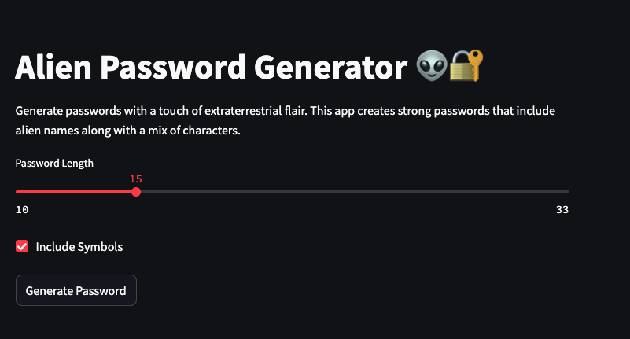

# 🛸 Alien Password Generator

I created an Alien Password Generator because I love aliens and wanted to try a new approach for the temporary passwords I need to use. This password generator is a simple Python script that uses Streamlit for its web interface. Additionally, it aims to stand out with an extraterrestrial twis

<p align="center">
  
</p>

## 🌟 Features

- Generate custom alien-themed passwords length
- Choose to either add symbols
- One-click copy functionality for easy use

## 🚀 Getting Started

### Prerequisites

- Python
- Streamlit

### Installation

1. Clone the repository:
   ```
   git clone https://github.com/Hckmar9/alienpass.git
   ```
2. **Create a virtual environment**:

   ```sh
   python3 -m venv venv
   source venv/bin/activate # On Windows, use `venv\Scripts\activate`
   ```

3. **Install required packages**:

   ```sh
   pip3 install streamlit
   ```

4. Start the development server:
   ```
   streamlit run app.py
   ```
5. Open your browser and visit `http://localhost:{PORT}` to see the app in action!

## 📜 License

This project is licensed under the MIT License.

Made with 👽 by [Hckmar](https://github.com/Hckmar9)
